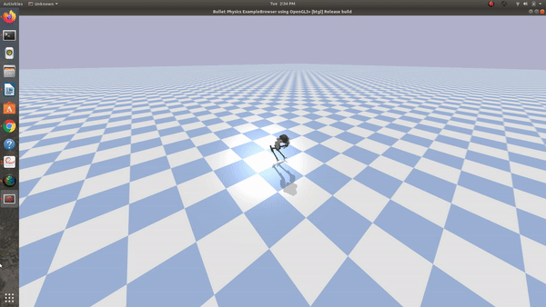

# Description
This implements everything needed for a few OpenAI gym environments. I created a gym environment for Dan's hopping robot, Agility Robotic's Cassie, and Boston Dynamic's Spot Mini. Look at Maurice's directory for the specefics of his Spot Mini.


# gym-cassie
OpenAI gym environment for Agility Robotic's Cassie robot. The gym-cassie directory has details about modifying the environment. Describe the reward function, and any timeouts etc. <br />

The agent's state is a vector of the joint angles. The agent has a PID controller on each of its joints. The agent's action is the list of new joint angles to have each PID controller track. Eventually, I would like to move toward direct torque control where the robot's action is a vector of the motor torque to apply on each joint. The PID control is a first step towards solving the more general case. It should be faster and simpler to learn than direct torque control. <br />

Below is a video of the agent following a random policy. <br />



# gym-hopping_robot
The hopping robot. Has details about modifying the environment. Describe the reward function, and any timeouts etc.  

# Instructions for Using My Environment 
```git clone <nameOfRepo>``` <br />
clone this repo and then run install from command line -> see the instructions

# Results  
Add an image/gif

# Connecting to Beast
To connect to Beast, run ```ssh peterj@beast.mech.northwestern.edu -p 922``` <br />
If you do sudo ssh ..., then you will not be able to access Beast and get a public key error message.


