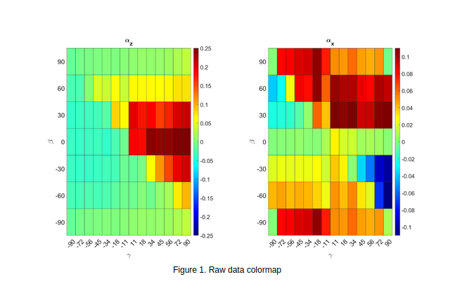
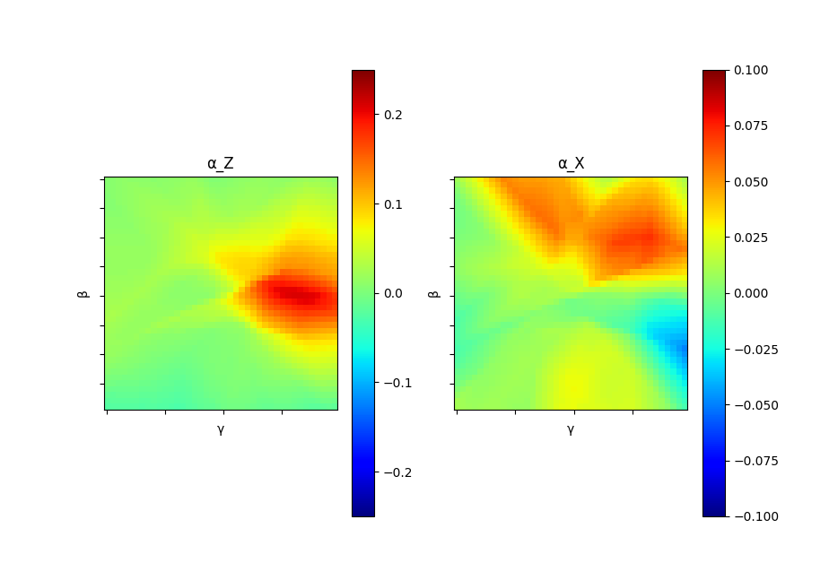

# This Week 
I generated a dataset with Chrono and used Keras and Tensorflow to create a neural network.

# Results 
Below, on the right is the original data from the Chrono simulation. On the left is the learned neural network mapping.

 

 
