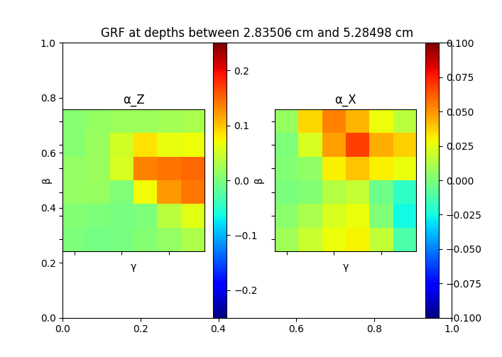
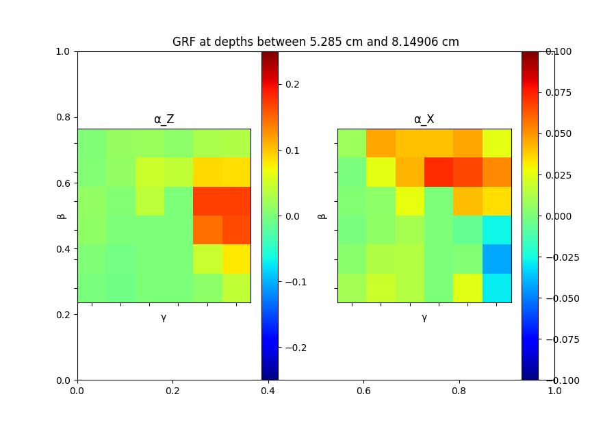

# Description
This is where I store Python files for wrangling datasets and processing the datasets with Keras and Tensorflow 

# processData.py
This is a Python script for reading in the dataset, creating a neural network, and then visualizing the learned mapping. It can use either Keras to make the neural network or Tensorflow. I found Keras to be easier to use and helpful for debugging the network. Ultimately, we want to use Tensorflow though because of its more open access to the computational graph. We want to eventually have not just a mapping from [gamma, beta, ...] to [Force_X, Force_y] but also the ability to compute arbitrary derivatives of this mapping. Tensorflow's API makes this very easy. 

# createOneDataset.py
This is a really short Python script which takes in a list of csv files created from Juntao's Kronos simulations and creates one really large dataset of the same format. To edit the list of files to add and where they are located, you only need to change a line or two of the 20 or so lines of code.  

# visualize.py
This segments the data into groups by depth and displays the raw data. This allows us to view how the GRF function changes as the foot moves further into the granular material.

## GRF At Diffrent Depths 
I segmented the data into quantiles by depth and for each group, plotted the simulated GRF data. This allows us to visualize how the GRF function changes as the foot traverses through the granular material. 

 

